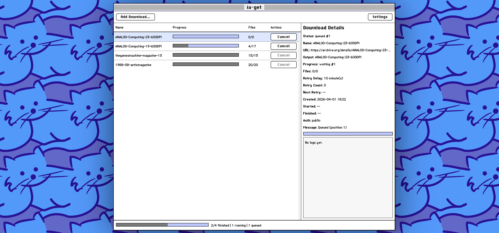

# ia-get Docker Wrapper



Containerized wrapper around [`L-K-M/ia-get`](https://github.com/L-K-M/ia-get) (a fork of `wimpysworld/ia-get` with authentication support), built for NAS-style deployments (including TrueNAS), with an optional web UI.

## Quick start

1. Copy environment defaults and adjust paths/UID/GID:

```bash
cp .env.example .env
```

2.a Build and run:

```bash
docker compose up -d --build
```

2.b Update:

```bash
docker compose down
docker compose build --no-cache
docker compose up -d
```

3. Open the web UI:

```text
http://<your-host-ip>:8080
```

4. Paste an archive URL like:

```text
https://archive.org/details/Something
```

Downloads will be written to the mounted host directory defined by `DOWNLOADS_PATH` in `.env`.

## Docker Compose configuration

Key values in `.env`:

- `IA_GET_REPO`: Upstream git repo used for `ia-get` build. Default: `https://github.com/L-K-M/ia-get.git`
- `IA_GET_REF`: Upstream branch/tag of `ia-get` to build. Default: `main`
- `WEB_PORT`: Host port mapped to UI/API. Default: `8080`
- `DOWNLOADS_PATH`: Host path bind-mounted to `/downloads`. Default: `./downloads`
- `PUID` / `PGID`: Runtime user/group IDs for file ownership. Default: `568` / `568`
- `TZ`: Container timezone. Default: `UTC`
- `MAX_LOG_LINES`: Max retained log lines per job. Default: `5000`
- `MAX_JOBS`: Max retained job history entries. Default: `25`
- `IA_USERNAME`: Optional default archive.org username/email for jobs. Default: empty
- `IA_PASSWORD`: Optional default archive.org password for jobs. Default: empty

## Using `ia-get` directly (without UI)

If you want CLI behavior only, override the container command:

```bash
docker compose run --rm ia-get-web /usr/local/bin/ia-get https://archive.org/details/<identifier>
```

Authenticated CLI example:

```bash
printf '%s' "$IA_PASSWORD" | docker compose run --rm ia-get-web /usr/local/bin/ia-get --username <email-or-username> --password-stdin https://archive.org/details/<identifier>
```

The compose volume still controls where files are written.

## Documentation

- TrueNAS deployment notes: `docs/TRUENAS.md`
- HTTP endpoints: `docs/API.md`
- Third-party notices: `THIRD_PARTY_NOTICES.md`

## License

This wrapper project is licensed under the MIT License. See `LICENSE`.

`ia-get` is also MIT licensed. Attribution is included in `THIRD_PARTY_NOTICES.md`.
